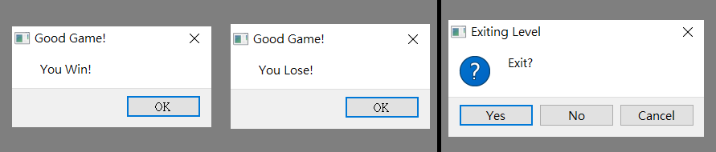
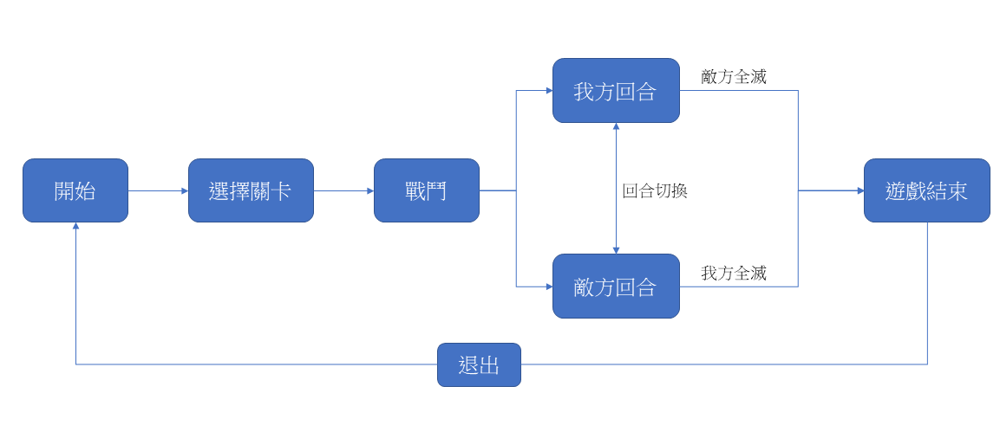
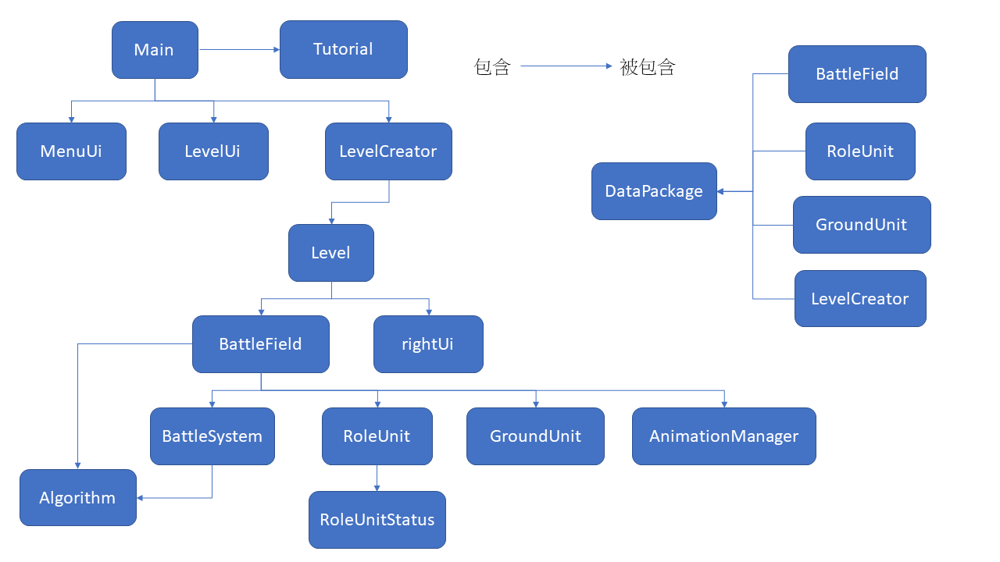

# My TBS Game——基於Qt的戰棋遊戲

[TOC]

## 1. 引言

### 1.1 背景

*My TBS Game* 是一款樸素的戰棋回合制(TBS)遊戲，透過在己方回合中操縱己方角色，巧妙佈局和行動，最終擊敗敵人。遊戲分為 *Player* 和 *Enemy* 陣營，玩家所在陣營是 *Player* ，回合中可行動的每個角色可進行一次移動和一次攻擊，勝負判定為敵方全滅和我方全滅。

### 1.2 開發環境

*My TBS Game* 採用 Qt 5 進行開發，同時以 VS code 為開發輔助。[^ 1] 

[^1]: 關於VS code 的配置及使用，請查看: https://www.cnblogs.com/zhiyiYo/p/14877952.html 

## 2. 程序運行的主要流程

### 2.1 流程概覧

本部分將演示遊戲遊玩流程。

#### 2.1.1 開始遊戲

遊戲啟動後，最開始顯示的是開始介面。

選擇 **START GAME** 會跳轉至關卡介面，選擇 **TUTORIAL** 跳轉至教程，選擇 **EXIT** 則會關閉遊戲。

#### 2.1.2 教程

暫無。

#### 2.1.3 選擇關卡

進入關卡介面後，可以選擇不同的關卡。遊戲會根據關卡的選擇而生成地圖大小、地形、角色等。

遊戲目前只有兩個關卡，生成多個按鈕的目的是為了展示其可擴展性。

#### 2.1.4 進入關卡

目前關卡有以下兩個場地。

選擇關卡後，遊戲進入戰鬥介面。點擊鍵盤的 +/- 號可以縮放場地。

右方界面大致可分為三個部分。

第一部分是角色介面，用戶點選角色後可通過此介面查看角色的所屬陣營、生命值等資訊。點擊按鈕可以切換角色的行動模式，同時按鈕上方的文字會配合改變顏色和說明。

第二部分是戰鬥紀錄，用戶在遊戲中的交互會顯示在文字欄中，用作回饋用戶的操作。點擊 **Clear** 清空欄位。

第三部分是回合介面，顯示戰鬥回合數和當前回合可行動的陣容。點擊 **End This Turn** 以結束當前回合。

#### 2.1.5 戰鬥流程

第一回合由我方先攻。在 **Move** 狀態下點選角色會顯示其行動範圍，在 **Attack** 狀態下則會顯示其攻擊範圍，如下圖所示。

**Move** 狀態下，點選行動範圍內的方格可以移動角色，點選行動範圍內的同陣營角色則切換焦點至該角色，點選行動範圍外的方格或者障礙地形等其餘操作則取消選擇角色。

**Attack** 狀態下，點選範圍內的同陣營角色則切換焦點，點選在攻擊範圍內的敵方角色則進行攻擊，其餘操作則取消選擇角色。攻擊時，角色依次播放攻擊動畫&音效、受傷動畫&音效，當角色死亡時會追加死亡動畫然後消失。

當角色進行移動和攻擊後，其會覆蓋以一層灰色遮罩，示意其不能再行動。

#### 2.1.6 勝利/失敗

當我方或敵方全滅時，系統判定遊戲結束並彈出對話框進行提示，如下圖。

點擊確認後會彈出離開對話框，按 **Yes** 返回開始介面，遊戲結束。

### 2.2 流程圖

## 3. 各個程序模塊之間的邏輯關係

此部分簡述各程序模塊之功能及其連接。關於其實際信號與槽關係，詳見附錄1。

### 3.1 關卡類 Level

#### 3.1.1 LevelCreator類

在用戶選擇關卡後，負責生成對應的Level類。初始化數據由 **DataPackage::levelData** 提供。
同時管理遊戲啟動及結束。

#### 3.3.1 Level類

關卡類，場地、介面的集成。執行生成場地、遊戲啟動及結束，管理場地與介面的信號連接。

### 3.2 場地類 BattleField

戰鬥場地的主體，存儲角色和地形。執行生成場地和角色。
按回合管理行動陣營，並管理角色選擇、範圍顯示、移動(包括尋路算法)、攻擊、移除等。
同時作為角色動畫交互的連接點。

### 3.3 地形類 GroundUnit

地圖的單位格。紀錄並提供(自定義的)地圖座標和畫面座標。

### 3.4 角色類 RoleUnit

#### 3.4.1 RoleUnit類

角色單位。執行移動、攻擊及其對應動畫(QPropertyAnimation)。
向BattleField類提供自身行動狀態及其控制接口。
存儲RoleUnitStatus類，並提供相應接口。

#### 3.4.2 RoleUnitStatus類

存儲角色的數據。初始化數據由 **DataPackage::characterStatus** 提供。

### 3.5 動畫類 AnimationManager

角色圖片的接口，負責管理角色的顯示。能夠根據角色的種類和行動狀態回應圖片請求。

### 3.6 (AI&回合)戰鬥邏輯類 BattleSystem

和BattleField類互相附着，負責管理回合計算和AI行動(包括尋路算法)。
同時管理並提供一個地圖方格可移動狀態的數組地圖。

AI不太聰明的樣子。

### 3.7 算法類 Algorithm

為角色提供尋路算法，主要在BattleField及BattleSystem上調用。

以**QPair**容器存儲座標點，使用**QVector**容器包裝輸出。採用A\*尋路算法，算法參考文獻見**參考資料**。

### 3.8 UI類

#### 3.8.1 MenuUi類

開始介面，可前往關卡介面或從關卡中返回。

#### 3.8.2 LevelUi類

關卡介面。生成並管理關卡按鈕，發送對應訊息。

#### 3.8.3 rightUi類

戰鬥介面。輔助管理角色、回合等。

#### 3.8.4 Tutorial類

教程介面。

### 3.9 數據包 DataPackage

存儲固定數據。

**namespace colorUsed:** 設定場地、移動範圍等相關顏色。

**namespace levelData:** 作為初始化Level的數據包，並建立不同關卡。

**namespace characterStatus:** 作為初始化RoleUnit的數據包，並建立不同角色。

**namespace animation:** 動畫執行所需時間。

### 3.10 關係概覧圖

## 4. 參考資料

角色美術來源: https://opengameart.org/content/lpc-medieval-fantasy-character-sprites

背景貼圖來源: https://opengameart.org/content/pixel-texture-pack

A\*尋路算法參考來源: https://www.youtube.com/watch?v=-L-WgKMFuhE

menu bgm: https://opengameart.org/content/calm-bgm

戰鬥 bgm: https://opengameart.org/content/rpg-battle-theme-ii

戰鬥結束 bgm: https://opengameart.org/content/end-credits-theme

攻擊音效: https://opengameart.org/content/37-hitspunches

受傷音效: https://opengameart.org/content/grunt

